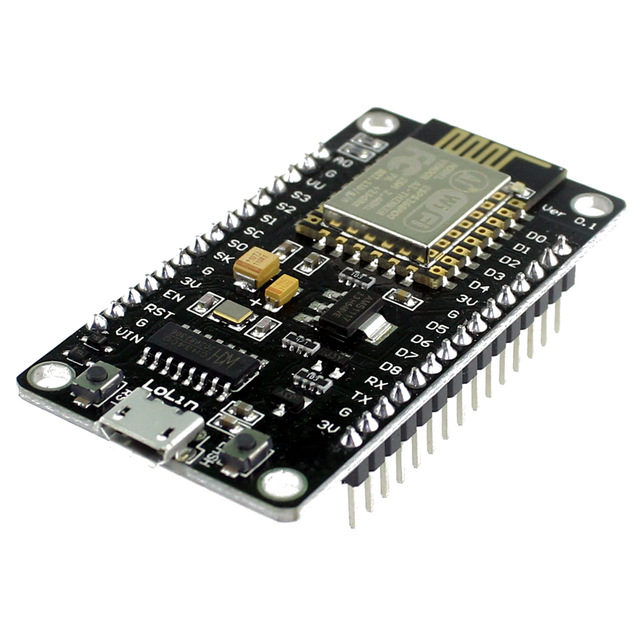
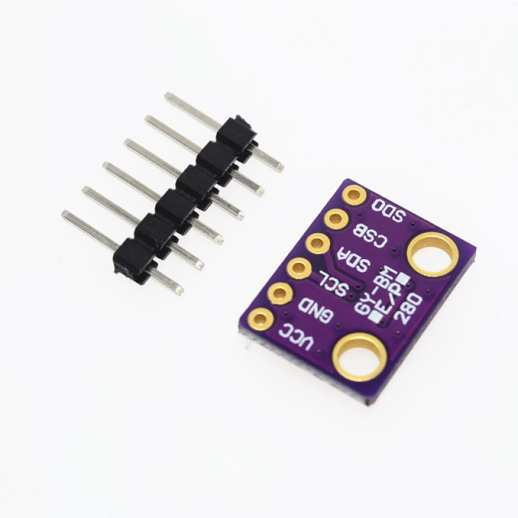
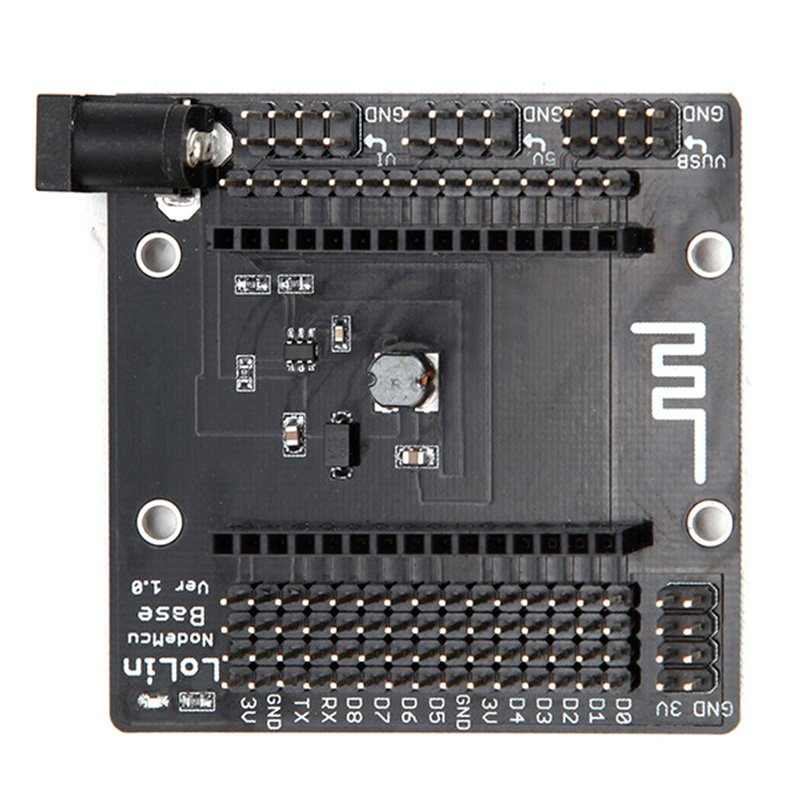
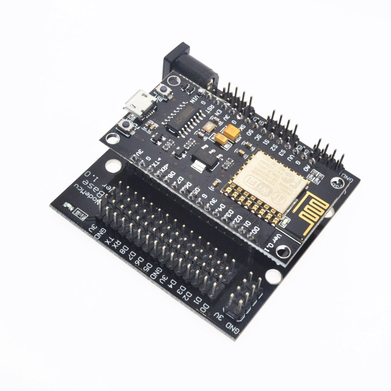
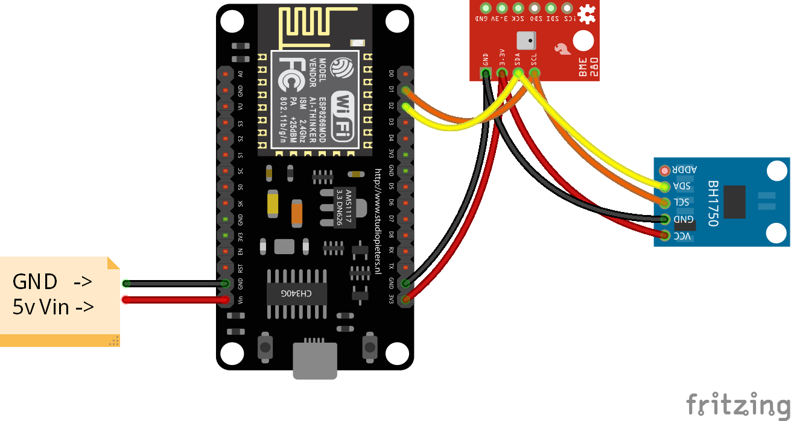

# NodeMCU-BME280-BH1750
Простая погодная станция на плате NodeMCU v3 с двумя недорогими датчиками. Станция умеет измерять температуру, атмосферное давление, влажность, освещенность и отправлять данные на сервис [Народный мониторинг](https://narodmon.ru/). 

За основу был взят код с [этого](http://arduinolab.pw/index.php/2015/12/30/datchik-temperatury-dlya-narodnogo-monitoringa-na-esp8266/) сайта и переписан под датчики, которые используются в моём проекте. Кроме сайта у автора есть также [канал на Youtube](https://www.youtube.com/channel/UCUjrgufq7KGvb1YTSkvcXnw). Советую, масса полезной информации по теме. Вот например [обзор датчика BME280](https://youtu.be/ATM9Vx5xtgo), который я использовал в этой метеостанции.

Код редактировался в редакторе [Atom](https://atom.io/). Для работы с платой NodeMCU прямо из редактора Atom необходимо дополнение [PlatformIO](https://platformio.org/). Для установки дополнения я использовал [этот гайд](http://docs.platformio.org/en/latest/ide/atom.html#installation).

## Железо
###### Плата NodeMCU v3

В моём случае на плате распаян преобразователь интерфейсов USB-UART CH340G, встречаются также платы в преобразователем CP2102. Работают одинаково, различия лишь в устанавливаемых драйверах.

###### Датчик освещённости BH1750

###### Датчик BME280
Совмещённый датчик температуры, влажности и атмосферного давления.

Ссылки на библиотеки для работы с датчиками.
* BH1750 https://github.com/claws/BH1750
* BME280 https://github.com/adafruit/Adafruit_BME280_Library
* Adafruit Unified Sensor Driver https://github.com/adafruit/Adafruit_Sensor

###### Опционально
Плата NodeMCU Base

для удобства подключения основной платы, а также различной переферии. На плате установлен преобразователь напряжения, позволяющий использовать блоки питания от 6v до 24v.

## Схема подключения датчиков

Датчики подключаются по шине I2C двумя проводами, ещё по двум проводам подводится питание.

| ESP8266| NodeMCUv3|BH1750|BME280|
|--------|----------|------|------|
| GPIO4  |D2        |SDA   |SDA   |
| GPIO5  |D1        |SCL   |SCL   |

###### Распиновка платы NodeMCU v3

